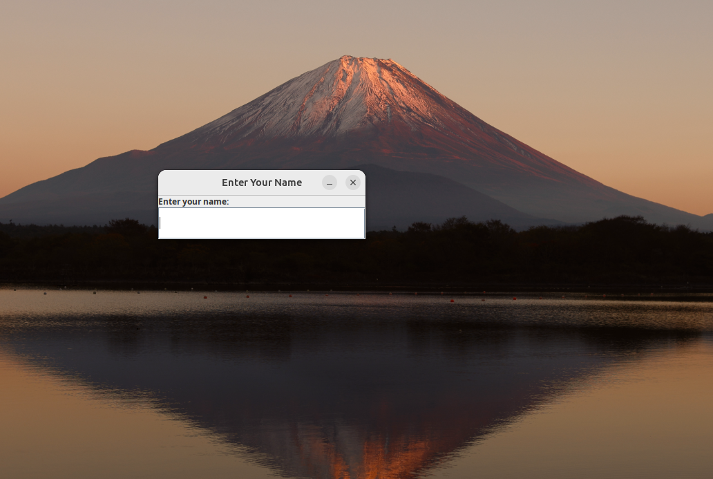
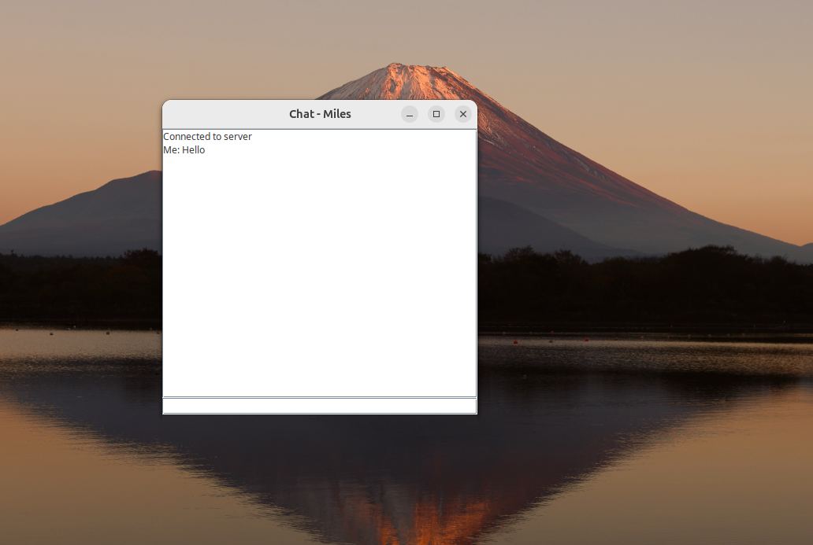
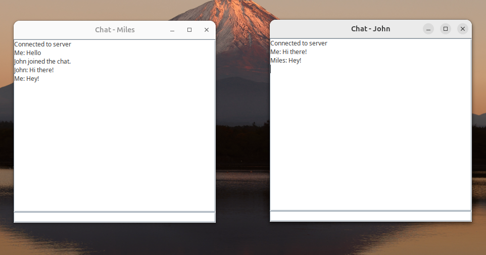
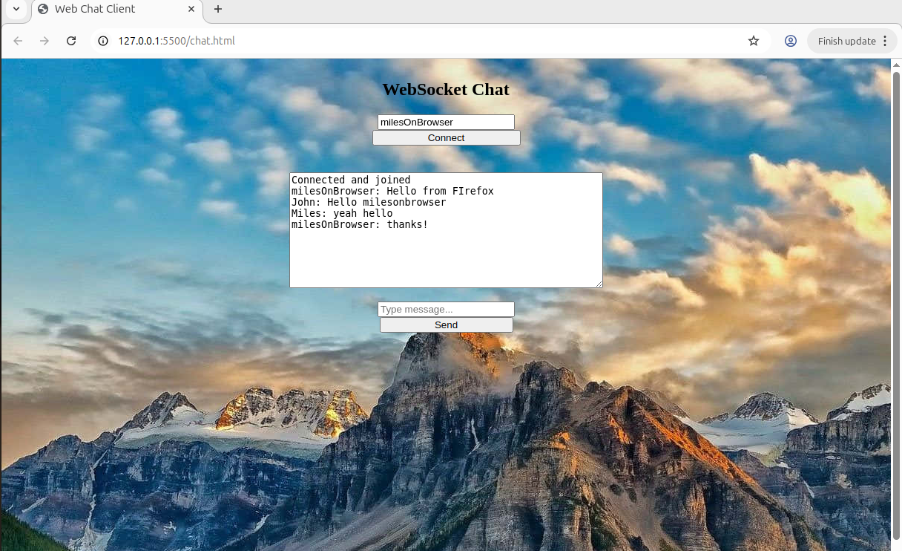
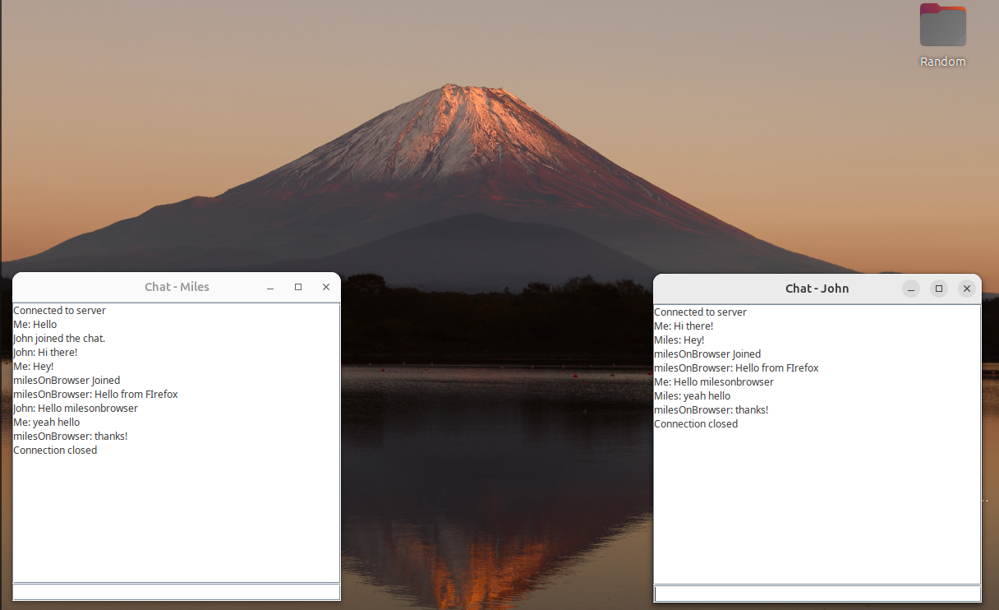

To run this project you need  
- slf4j-simple.jar (Version ~1.7.36)
- slf4j-api.jar (Version ~1.7.36)
- Java_WebSocket.jar (Version ~1.60)  
- Stable version of java sdk eg. 21

To preview this project, first run the ChatServer.java file, next either connect a client through running one or more of ChatClient.java file or you can run the website in your browser and connect to the server via the websocket via the browser  

 
 
 
 
 
 
 

