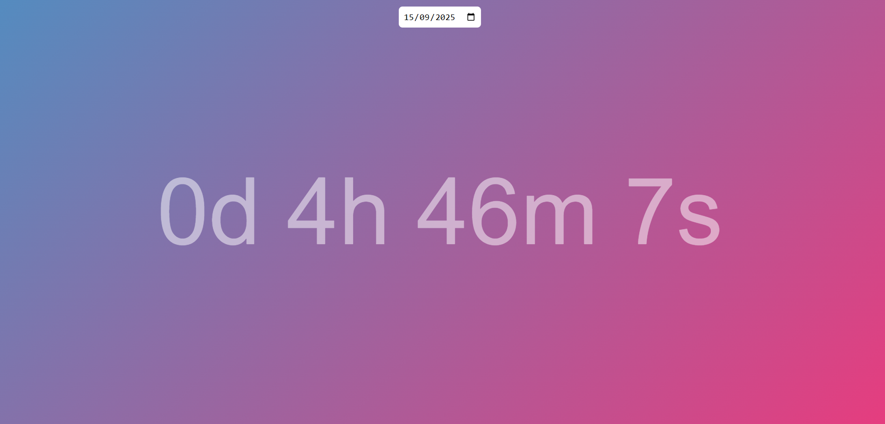
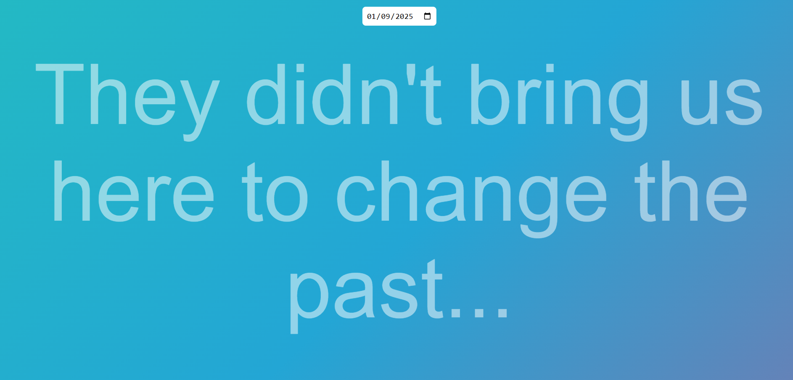

This is a project that displays the time between two dates providing that the date is ahead of the current day. This was created as it can be found that visualising the days until an event can help boost motivation or feelings towards it since the time is quantified.  

 
 
Furthermore, if you try to do a date in the past, it simply reminds you that you cannot alter what has happened.
 
 

