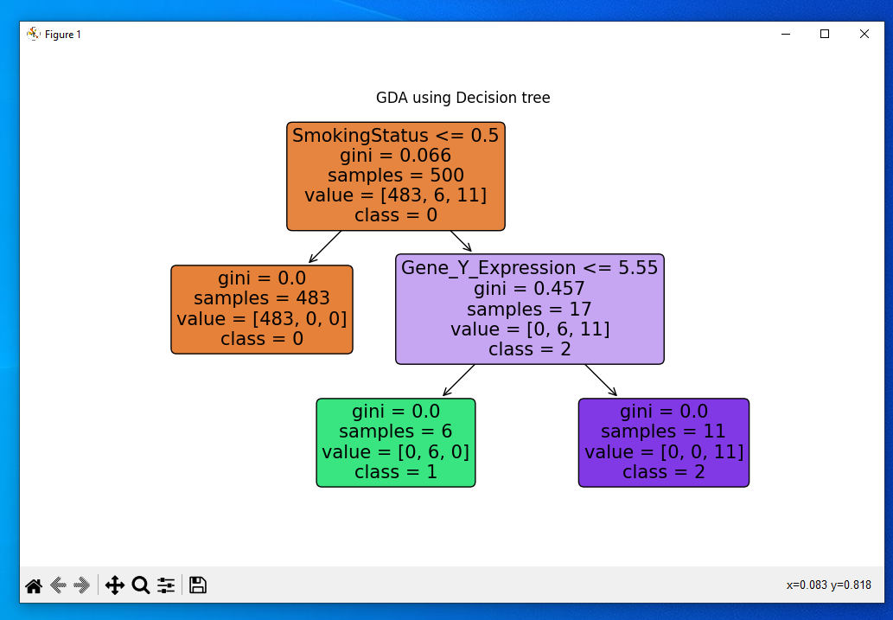
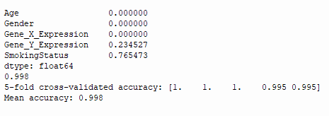
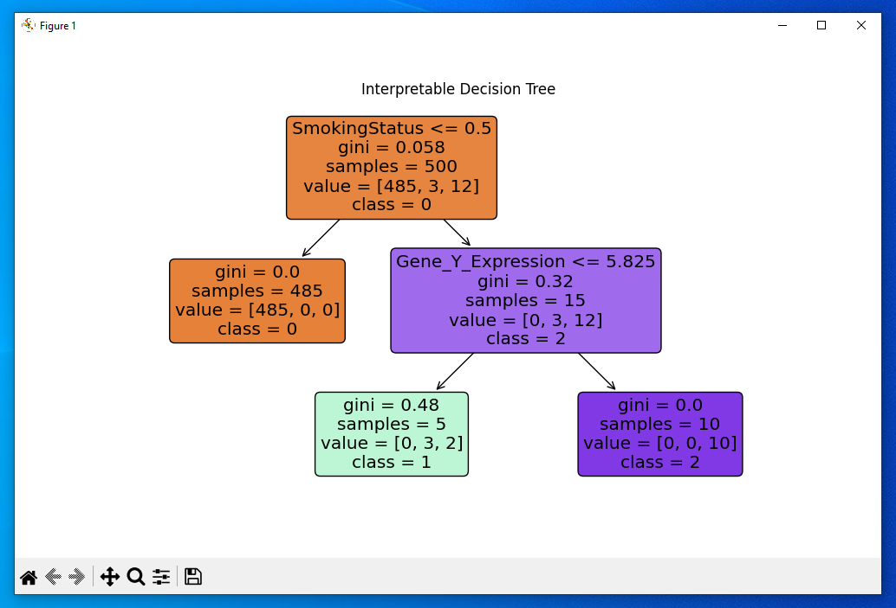
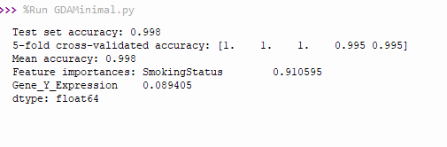

## Dataset Attribution

This project uses the "Gene Expression Analysis and Disease Relationship" dataset, downloaded from [Kaggle](https://www.kaggle.com/datasets/ylmzasel/gene-expression-analysis-and-disease-relationship).  

- **Creator:** [Asel YILMAZ]  
- **License:** [CC BY 4.0](https://creativecommons.org/licenses/by/4.0/)  
- **Changes:** Some preprocessing was applied but only in script not raw dataset ~ (dropped columns, feature selection).

## Findings
This project is a Decision Tree Classifier as part of Supervised Learning on this dataset. It aims to find a link between certain factors and the disease. In this project, the stats are not from real patients so no infringement on privacy is created. The disease category has 3 types:
- 0 ~ No disease
- 1 ~ Disease Type 1
- 2 ~ Disease Type 2

From my intial file, GDA.py I found that if you did not smoke (Smoking Status = 0), then you would not have the disease. However, if you did smoke (1-regularly, 2-very frequently), then it determines how much of the Gene_Y_Expression you have. From an overview, if you did smoke, you would have a 44% chance to have type 1 and a 56% to have type 2. If we explore the tree further, if you have less than 5.5 Gene_Y_Expression, then you would have disease type 1 else type 2. This model has mean accuracy of 0.998 meaning it has a ~99.8% accuracy rate of determining if someone has any type of the disease based on factors. In conclusion, in the model, patients with Smoking Status = 0 were always classified as No Disease and if you do smoke, then it depends on your gene_y_expression.

## Other factors that could improve this analysis
This dataset lacks other more important quantities such as years of smoking, weight, height. So this analysis has to be taken in the context of only having those stats available, as in a normal setting, you would have more information which would make it easier to generalise and way more accurate. In this dataset, all smokers were classified as having disease type 1 or 2, but in reality, smoking alone may not guarantee disease due to other unmeasured factors.

## Last Takeaways
Feature importance analysis shows Smoking Status accounts for ~76–91% of the splits, and Gene_Y_Expression accounts for ~9–23%, depending on the feature set. These findings reflect patterns in the dataset but should not be interpreted as causal in real-world populations.

## GDA.py

 
 
## GDAMinimal.py

 
 
