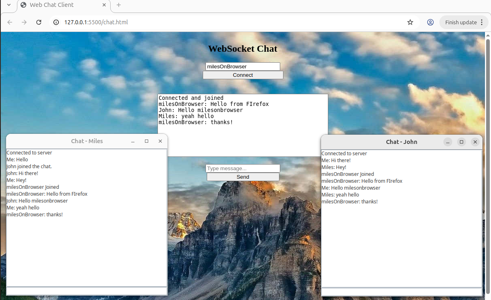
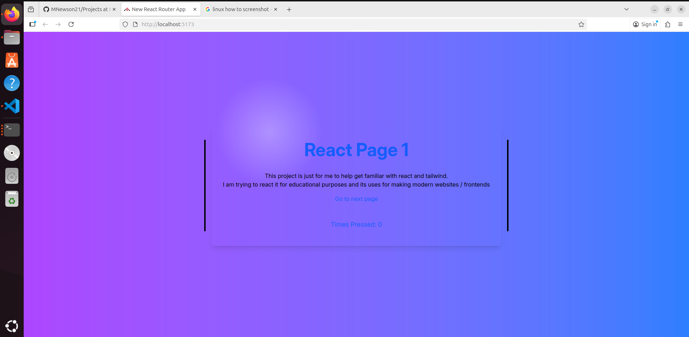
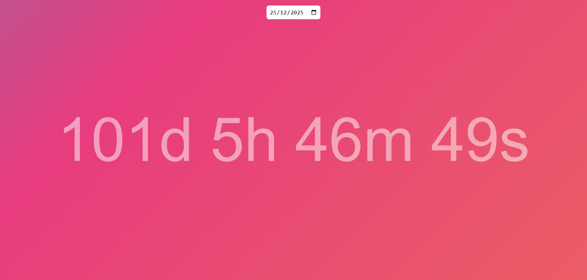
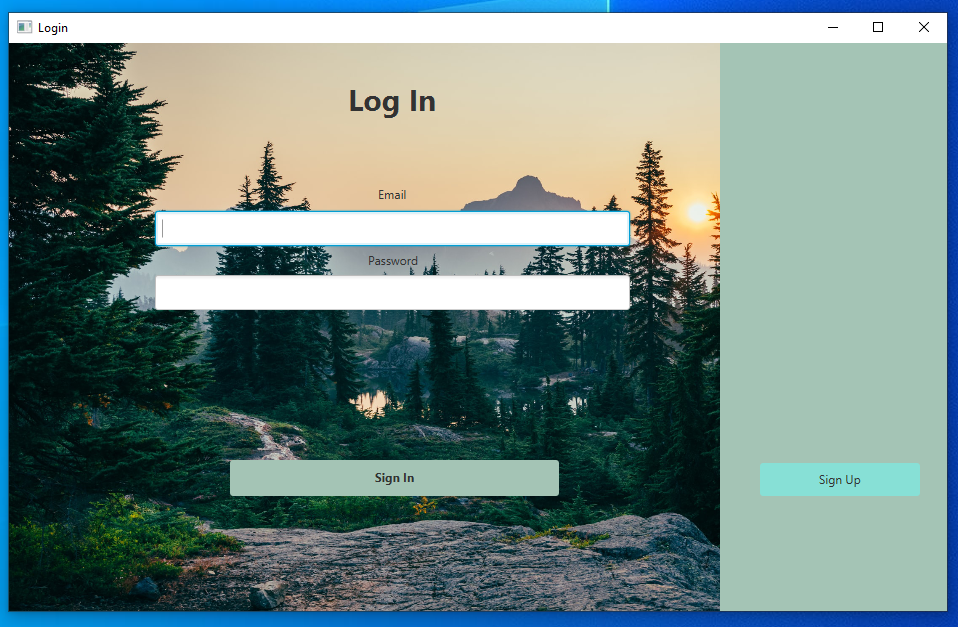

Hello I am Miles Newson    
This is my personal git for projects that I make alongside studying Computer Science   
- I am currently in the second year of my degree as of this readme update  
- This is also used to improve my proficiency in languages that I know   
- I also do leetcode in my spare time ~ https://leetcode.com/u/milesn/    

The main languages I am using / learning about at the moment are
- Java
- C
- Lean

If you see this, thank you for taking the time to view my repository  
peace  

Here are some examples of some of my main projects in this repository

 

 

 

 

 

