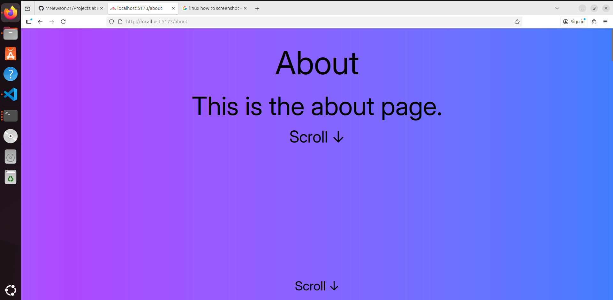

### Introductory React Project
This is just a small project which demonstrates me learning React with Tailwind using React Router 7.
I have created this to help me demonstrate the uses of react and the reason that these tools have been created to make interactive displays and to speed up production.

### How to run
- Download and the command npm install 
- This will installed the required node_modules.
- Then run npm dev